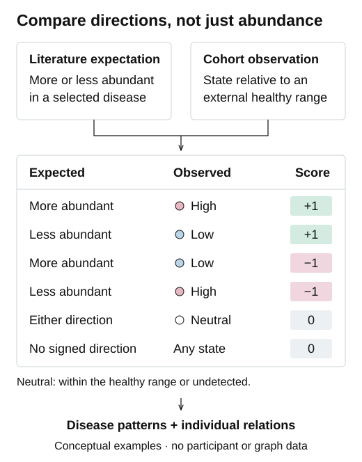

# MINERVA-Projection

**문헌 지식을 코호트에 투영해, 다음 연구에서 검증할 관계를 찾습니다.**

축적된 마이크로바이옴 문헌 지식을 실제 인간 코호트에 적용하면 어떤 모습이 나타날까요? MINERVA-Projection은 문헌의 방향을 명시적인 예상으로 바꾸고, 실제 풍부도 상태와 비교하여 두 자료가 일치하는 관계와 반대되는 관계를 보여줍니다.

질환 패턴 전체와 그 안의 개별 미생물 관계를 함께 살펴볼 수 있습니다. 전체 신호가 강해도 개별 관계에는 일치와 반대가 섞여 있을 수 있습니다. 이 차이를 드러내면 다음에 무엇을 연구할지 더 구체적으로 정할 수 있습니다.

[English](README.md) · [입력 자료 안내](docs/data-format.md) · [분석 원리](docs/methods.md) · [결과 해석](docs/interpretation.md)

## 문헌의 방향과 실제 관찰을 비교합니다

문헌에서는 특정 질환에서 미생물 속이 **더 풍부하다**거나 **덜 풍부하다**고 보고할 수 있습니다. 실제 참여자의 풍부도는 **같은 분석 자료원의 다른 연구**에서 얻은 건강 대조군 참조구간과 비교합니다.

| 문헌의 예상 | 관찰된 상태 | 기여 점수 |
| --- | --- | --- |
| 질환에서 더 풍부함 | High | **+1** — 일치 |
| 질환에서 덜 풍부함 | Low | **+1** — 일치 |
| 질환에서 더 풍부함 | Low | **−1** — 반대 |
| 질환에서 덜 풍부함 | High | **−1** — 반대 |
| 어느 방향이든 | 참조구간 내부 또는 미검출 | **0** |
| 부호가 있는 문헌 방향 없음 | 어떤 상태이든 | **0** |

**풍부도가 낮다고 기여 점수가 −1이 되는 것은 아닙니다.** 문헌의 예상과 실제 관찰이 모두 낮은 방향이면 +1입니다.

<p align="center">
  
</p>

## 무엇을 분석할 수 있나요?

- **문헌 합의:** 추출 기록들을 출판물별 한 표로 합치고, 출판물 표를 모아 질환–미생물 속 관계의 예상 방향을 정합니다.
- **참여자 점수:** 외부 건강 참조구간을 구하고 풍부도 상태를 판정한 뒤, 문헌과의 방향 일치를 합산합니다.
- **질환 전체의 패턴:** 연구–질환 비교 안에서 점수를 표준화하고, 연구로 층화한 조건부 로지스틱 회귀로 환자 여부와의 연관성을 평가합니다.
- **개별 관계:** 연구별로 환자와 대조군의 평균 상태 차이를 구하고 연구마다 같은 가중치로 평균해, 일치·반대·정확한 0을 요약합니다.

출판물 투표, 참조구간, 참여자 점수, 관계별 요약까지 단계별 표를 확인할 수 있습니다.

## 합성 예제 실행

저장소의 최상위 폴더에서 Python 3.10 이상 환경에 패키지를 설치합니다.

```bash
python -m pip install -e .
```

포함된 예제를 실행합니다.

```bash
python -m minerva_projection run --participants examples/synthetic/participants.csv --abundance examples/synthetic/abundance.csv --votes examples/synthetic/votes.csv --output demo_output
```

**예제의 모든 기록은 합성 자료입니다.** 질환명, 미생물명, 출판물 식별자와 풍부도 값은 실행 과정을 보여주기 위해 만든 가상 정보입니다. 실제 참여자 자료나 추출된 문헌 근거가 아닙니다.

먼저 `demo_output/run_summary.json`을 확인한 뒤 `scores.csv`, `disease_associations.csv`, `relation_alignment.csv`를 살펴보세요. 전체 출력과 입력 형식은 [입력 자료 안내](docs/data-format.md)에 설명했습니다.

같은 합성 예제를 다른 폴더에 생성하려면 다음 명령을 사용합니다.

```bash
python -m minerva_projection synthetic --output my_synthetic_inputs
```

## 자신의 코호트 분석

다음 세 CSV 파일을 준비합니다.

| 파일 | 필요한 내용 |
| --- | --- |
| 참여자 정보 | 표본·자료원·연구 식별자, 환자/대조군, 질환명 |
| 풍부도 | 표본별 한 행, 미생물 속별 한 열; 단위는 **백분율 값** |
| 문헌 투표 | 질환–미생물 속별 추출 기록, 출판물 식별자, −1·0·+1 방향 |

외부 참조를 구성할 수 있도록 같은 분석 자료원에 속한 다른 연구의 건강 대조군도 포함합니다. 세 파일의 미생물 속과 질환 이름을 미리 통일해야 합니다. 기본 평가 기준은 환자 10명, 같은 연구의 대조군 10명, 외부 건강 참조 100명입니다. 관계별 전체 비교는 기본적으로 두 개 이상의 분석 자료원에서 평가할 수 있는 질환을 대상으로 하며, 질환 전체의 점수 연관성은 한 자료원에서도 평가합니다.

[입력 자료 안내](docs/data-format.md)에서 파일 형식, 선택적 문헌 제외, 적격성 기준과 실행 명령을 확인할 수 있습니다. 점수와 집단 비교의 원리는 [분석 원리](docs/methods.md)에 정리했습니다.

## 일치와 반대를 어떻게 활용하나요?

일치는 다음 연구에서 살펴볼 후보를 제시하고, 반대는 출처 근거나 코호트의 맥락을 더 자세히 확인할 질문을 제시합니다. 어느 쪽도 그 자체로 인과관계나 치료 효과를 확정하지 않습니다. 관계의 부호는 이 참조 규칙 아래에서 관찰된 방향을 요약하며, 통계적 유의성 검정은 아닙니다.

이 저장소는 사용자가 제공하는 자료에 핵심 투영·연관성 분석을 적용하는 코드입니다. 합성 예제는 실행 과정을 보여주며, 논문에 포함된 전체 분석을 그대로 재실행하는 자료 묶음은 아닙니다.

## 프로젝트

관련 연구: **A literature-to-cohort framework for microbiome discovery**.

연구 조직: [MGH-LMIC](https://github.com/MGH-LMIC/).

저장소: [MINERVA-Projection](https://github.com/MGH-LMIC/MINERVA-Projection).

이 연구의 결과를 [MINERVA Landscape](https://minervabio.org/app/landscape)에서 대화형으로 탐색할 수 있습니다.
